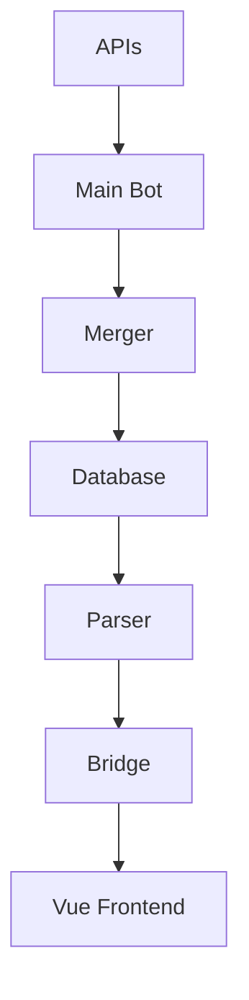

# Sports Bot Project Flow

## Project Overview
This project is a sports data aggregation and display system, currently focused on tennis data. The system fetches data from multiple APIs, processes it, and displays it through a Vue.js frontend.

## Component Status

### 1. Main Bot (✅ Completed)
- **Purpose**: Central orchestrator for data fetching
- **Location**: `/sports-backend/aggregator/sports/tennis/tennis_bot.py`
- **Features**:
  - Coordinates data fetching from multiple APIs
  - Handles API rate limiting and retries
  - Manages data flow between components

### 2. Merger (✅ Completed)
- **Purpose**: Data combination from multiple sources
- **Location**: `/sports-backend/aggregator/sports/tennis/tennis_merger.py`
- **Features**:
  - Combines raw data from different APIs
  - Matches stats with corresponding tennis events
  - Preserves all original data fields

### 3. Database (🔄 In Progress)
- **Purpose**: Raw data storage
- **Location**: `/sports-backend/aggregator/sports/tennis/tennis_database.py`
- **Current Status**: Basic setup complete
- **Pending Work**:
  - Create necessary database tables
  - Implement additional storage logic
  - Add data retrieval methods

### 4. Parser (📝 To Be Implemented)
- **Purpose**: Data transformation for frontend
- **Status**: Not started
- **Planned Features**:
  - Extract relevant data from raw storage
  - Transform data into frontend-friendly format
  - Filter unnecessary information

### 5. Backend-Frontend Bridge (📝 To Be Implemented)
- **Purpose**: Data communication layer
- **Status**: Not started
- **Planned Features**:
  - API endpoints for frontend data access
  - Real-time data updates
  - Data format validation

### 6. Vue Frontend (🔄 In Progress)
- **Purpose**: User interface
- **Location**: `/sports-frontend`
- **Current Status**: Basic setup complete
- **Pending Work**:
  - Implement data display components
  - Add real-time updates
  - Create user interaction features

## Data Flow

## Current Focus
The project is currently focused on the tennis component, with plans to expand to other sports in the future. The immediate priorities are:

1. Complete the database implementation
2. Create the parser component
3. Implement the backend-frontend bridge
4. Develop the Vue.js frontend display logic

## Next Steps
1. Define database schema and create tables
2. Design and implement the parser logic
3. Set up API endpoints for frontend communication
4. Develop frontend components for data display
