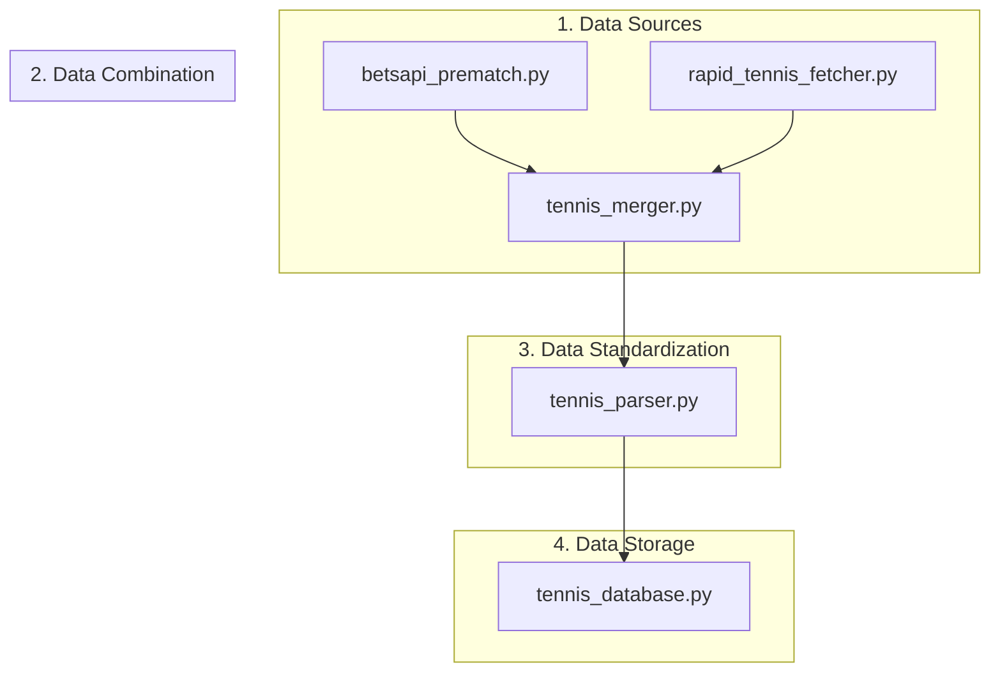

# Tennis Data Flow Architecture



## Component Details

### 1. Data Sources (API Fetchers)
- **betsapi_prematch.py**
  - Fetches prematch tennis data
  - Self-contained with hardcoded credentials
  - Returns raw prematch odds and event data

- **rapid_tennis_fetcher.py**
  - Fetches live tennis match data
  - Self-contained with hardcoded credentials
  - Returns raw live odds and event data

### 2. Data Combination
- **tennis_merger.py**
  - Combines data from both API sources
  - Matches events with their corresponding odds
  - Handles data deduplication if needed

### 3. Data Standardization
- **tennis_parser.py**
  - Converts raw API data into standardized format
  - Ensures consistent data structure
  - Handles edge cases and data validation

### 4. Data Storage
- **tennis_database.py**
  - Stores standardized tennis data
  - Handles database operations
  - Provides data retrieval methods

## Data Format Examples

### Raw API Data → Standardized Format
```python
# Raw BetsAPI Data
{
    "bet365_id": "123",
    "inplay_event": {...},
    "raw_prematch_data": {...}
}

# Raw RapidAPI Data
{
    "raw_event_data": {...},
    "raw_odds_data": {...}
}

# After Merger & Parser
{
    "match_id": "123",
    "event_name": "Player1 vs Player2",
    "status": "Live",
    "score": "6-4, 2-3",
    "players": {
        "home": "Player1",
        "away": "Player2"
    },
    "odds": {
        "Match Winner": {
            "Player1": 1.85,
            "Player2": 1.95
        }
    }
}
```

## Key Points
1. Each fetcher is self-contained with its own credentials
2. Merger combines data from multiple sources
3. Parser ensures consistent data format
4. Database handles final storage of standardized data

## File Locations
All files are located in: `/root/sports-backend/aggregator/sports/tennis/`
